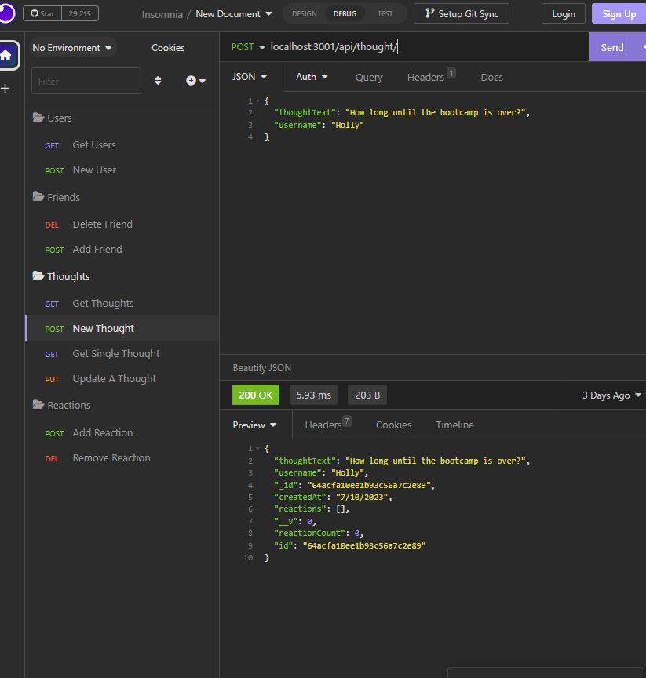

# social-network-api

## Description

The project is about creating a social network API and obtaining information based off endpoints. The project is to show the basic steps that something like this would be created. To be able to show new developers how something like this can be attained and the ease of it. There will be problems and some that I ran into were finding out why the endpoint I wrote up wasn't working and making sure that each folder were connected correctly. By going through a process like this, it helps teach the developer to be thoughtful and plan how one should begin writing their code. Experienced or not, it will help with the future. 

Provide a short description explaining the what, why, and how of your project. Use the following questions as a guide:

## Table of Contents (Optional)

If your README is long, add a table of contents to make it easy for users to find what they need.

- [Installation](#installation)
- [EndPoints](#endpoints)
- [Information](#information)

## Installation

To install, the developer will follow the github repo and clone it down into their terminal. Once they have it cloned, the developer will want to make sure they have Insomnia, to help with the endpoints, and MongoDB Compass, to help with visualizing of the databases. 

Once the developer has the project installed, they will install the necessary packages and then use 'npm start'. From there they will use Insomnia to test out the endpoints and can also use MongoDB Compass to see the databases as they test it out. 

# EndPoints

## Users

Using the following end point with GET and POST, will allow the developer to get all users and create a new user
 - /api/user

The following end point with GET, PUT, and DELETE will allow the developer to get a single user, update a single user, and delete a single user
 - /api/user/:userId

Using POST and DELETE with this endpoint, allows the developer to add a friend or delete a friend
 - /api/user/:userId/friends/:friendId

## Thoughts

This end point with GET and POST, will let the developer to pull up all thoughts annd create a new thought
- /api/thought/

Following this endpoint pulls the thoughtID with GET, PUT, and DELETE. Doing so gets a single thought, updates a specific thought, and deletes a thought
- /api/thought/:thoughtId

With POST the developer will be able to create a new reaction on a thought
- /api/thought/:thoughtID/reactions

With DELETE, the developer will be able to remove a reaction on a thought
- /api/thought/:thoughtID/reactions/:reactionId

## Information

https://drive.google.com/file/d/1U_n4IP99K_9tpDbXZY9aBlvLIXptg1vV/view

https://github.com/Gramer35/social-network-api
